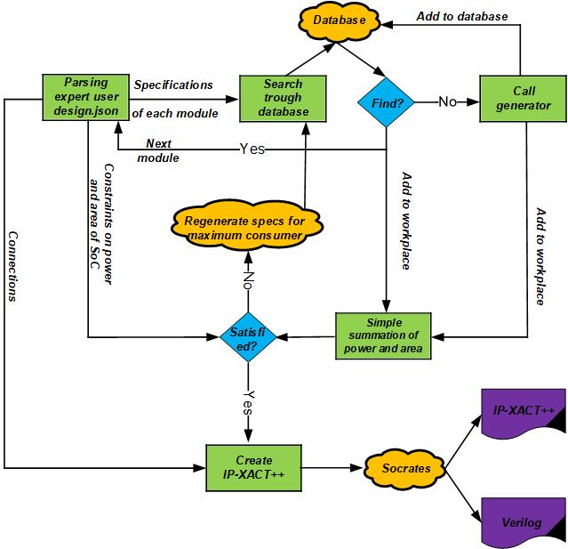

### SoC Integration
These are steps for running correct-by-construction SoC integration:
* `cd soc`

* Refer to each of [generators](https://github.com/idea-fasoc/fasoc/tree/master/generators) to see instructions for providing aux_lib, calibreRuleFiles, model, SRAM_2KB directories. Please write these directoriers in `fasoc/config/platform_config.json` based on the technology node. Here is an example of platform_config.json for tsmc65lp:

* Providing a design in json format. These are elements of such a design:
    * "constrains": The total power and area budget of the desired SoC
    * "modules": Different generators with different specfications that are desired to be included in the SoC
          *  "module_name": The design should have unique name for each module
          *  "instance_name": The name of each instances of the module. It should be noted even if one of the specifications of two modules are different, this means different modules not different instances. Instances are used if multiple instances from a module is needed.
          *  "generator": The generator name of the module. It should be one of the generators that is listed [here](https://github.com/idea-fasoc/fasoc/tree/master/generators).
          *  "specifications": Specifications of each module. Please refer to each [generator](https://github.com/idea-fasoc/fasoc/tree/master/generators) to find these specifications.
    * There are several sample designs [here](https://github.com/idea-fasoc/fasoc/tree/master/tests) that it can be refered to.

* `soc.py --design design_dir --mode design_mode --database add_remove` 

The below loop will start after running make the SoC:

For more information about how SoC Integration works you can go to [here](https://github.com/idea-fasoc/fasoc/blob/master/doc/SoC%20Integrator%20Walkthrough.pdf)
