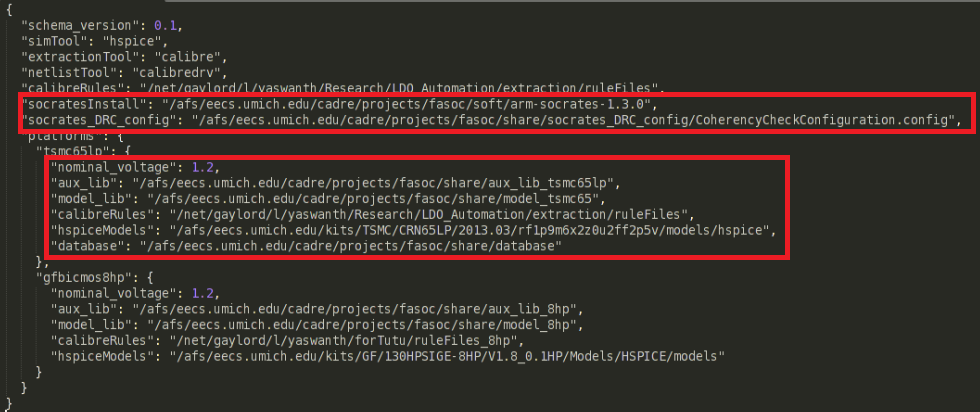
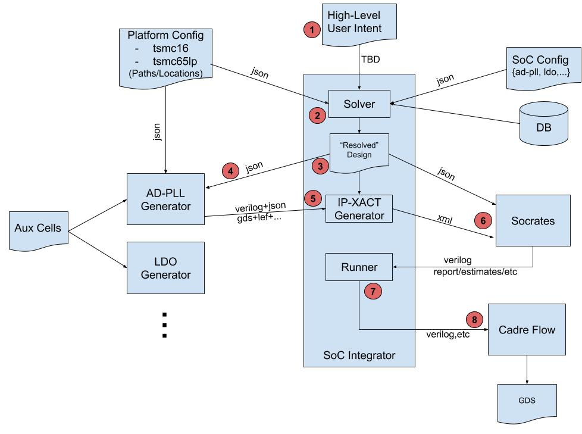

### SoC Integration
These are steps for running SoC integration:
1. Please navigate to soc folder.

2. Please refer to [here](https://github.com/idea-fasoc/fasoc/tree/master/generators/ldo-gen) for ldo,  [here](https://github.com/idea-fasoc/fasoc/tree/master/generators/pll-gen) for pll, [here](https://github.com/idea-fasoc/fasoc/tree/master/generators/memory-gen) for memory README and see what should be provided for aux_lib, calibreRuleFiles, model, SRAM_2KB directories. Please write these directoriers paths in platform_config.json inside config directory. Here is an example of how platform_config.json should look like.

3. There are several sample designs (json and makefile) in tests/tool_integration directory that you can refer to create your own design.

The below loop will start after running make soc:

For more information about how SoC Integration works you can go to [here](https://github.com/idea-fasoc/fasoc/blob/master/doc/SoC%20Integrator%20Walkthrough.pdf)
